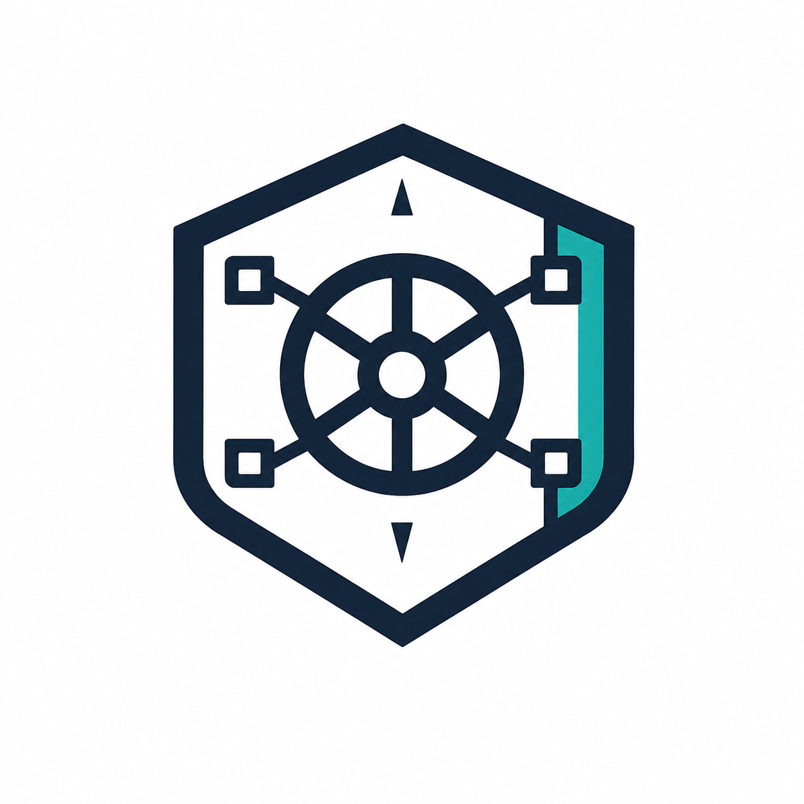

<a name="readme-top"></a>

# Vaultsmith



A small web UI for encrypting, decrypting, and re-keying Ansible Vault values.

Vaultsmith supports Ansible Vault 1.1 and 1.2/AES256. It runs as one Go binary with the React UI embedded in it.

## Table of contents

- [About the project](#about-the-project)
- [Built with](#built-with)
- [Getting started](#getting-started)
- [Configuration](#configuration)
- [Usage](#usage)
- [Deploy with Helm](#deploy-with-helm)
- [Security](#security)
- [Development](#development)
- [Contributing](#contributing)
- [License](#license)

## About the project

Vaultsmith is for short, deliberate operations on one value at a time:

- Encrypt plaintext with a selected vault profile.
- Decrypt an existing Vault 1.1 or 1.2 value.
- Re-key a value from one profile to another.
- Copy an Ansible `!vault` variable snippet from the result.

The server loads vault passwords from environment variables. The browser receives profile IDs and labels, then sends the value being operated on to the server. Vaultsmith does not persist values, upload files, store browser state, or log request bodies.


Limits are deliberate:

- Encrypt: up to 1 MiB of UTF-8 plaintext.
- Decrypt and re-key: up to 5 MiB of UTF-8 Vault text.
- JSON request body: up to 8 MiB.

## Built with

- [Go](https://go.dev/) for the server and Ansible Vault operations.
- [React](https://react.dev/) and [TypeScript](https://www.typescriptlang.org/) for the UI.
- [Helm](https://helm.sh/) for Kubernetes deployment.
- Docker for the packaged image.

## Getting started

### Prerequisites

- Go 1.25 or newer
- Node.js 22 LTS and npm
- A POSIX shell

`ansible-vault` is not required at runtime. The optional compatibility test uses it when available.

### Run locally

Build the frontend into the directory embedded by the Go server:

```sh
nvm use
npm ci --prefix frontend
npm run build --prefix frontend
```

Start the server with a local profile. The password below is only a placeholder; replace it in your shell session and do not commit it.

```sh
export VAULT_PROFILES_JSON='[{"id":"dev","label":"Development","passwordEnv":"VAULT_PASSWORD_DEV"}]'
export VAULT_PASSWORD_DEV='replace-with-a-local-password'
go run ./backend/cmd/server
```

The server listens on `http://localhost:8080`. Set `HTTP_ADDR` to use another address, for example `HTTP_ADDR=127.0.0.1:18080`.

For frontend work, keep the Go server running and start Vite in a second terminal:

```sh
npm run dev --prefix frontend
```

## Configuration

`VAULT_PROFILES_JSON` contains profile metadata. Each profile points to a separate environment variable containing its password:

```json
[
  {
    "id": "dev",
    "label": "Development",
    "passwordEnv": "VAULT_PASSWORD_DEV"
  },
  {
    "id": "prod",
    "label": "Production",
    "passwordEnv": "VAULT_PASSWORD_PROD"
  }
]
```

The server rejects reserved environment names, duplicate profile IDs, missing passwords, and invalid profile metadata. Password values are not returned by the profiles API.

## Usage

The UI has three operation modes: `encrypt`, `decrypt`, and `rotate`. A rotate request names both the source and destination profile.

List the profiles exposed to the browser:

```sh
curl -fsS http://localhost:8080/api/v1/profiles
```

Encrypt a synthetic value:

```sh
curl -fsS \
  -H 'Content-Type: application/json' \
  --data '{"profileId":"dev","mode":"encrypt","value":"example-value"}' \
  http://localhost:8080/api/v1/operations
```

Decrypt an existing value with `profileId` and `mode: "decrypt"`. Re-key one with this request shape:

```json
{
  "mode": "rotate",
  "sourceProfileId": "dev",
  "destinationProfileId": "prod",
  "value": "$ANSIBLE_VAULT;1.1;AES256\n..."
}
```

Keep real plaintext, ciphertext, and passwords out of shell history, logs, tickets, screenshots, and pull requests.

## Deploy with Helm

The chart lives in `deploy/helm/vaultsmith`. It uses a `ClusterIP` service, leaves Ingress disabled, disables service-account token automount, and leaves NetworkPolicy disabled by default. The chart does not create the password Secret.

Create the Secret outside Helm, then reference it from a values file:

```yaml
profiles:
  - id: dev
    label: Development
    passwordEnv: VAULT_PASSWORD_DEV
    passwordSecretKey: dev

secret:
  existingSecret: vaultsmith-passwords

networkPolicy:
  enabled: true
  denyAllIngress: true
  allowedIngress: []
```

Install the local chart:

```sh
helm upgrade --install vaultsmith deploy/helm/vaultsmith \
  --namespace vaultsmith \
  --create-namespace \
  -f /path/to/vaultsmith-values.yaml
```

Set `denyAllIngress: true` with an empty `allowedIngress` list for an explicit deny-all policy. For an allowlist, leave `denyAllIngress` false and add `namespaceSelector` or `podSelector` entries. NetworkPolicy is not authentication. Put an authenticated or private edge in front of the service before enabling Ingress.

## Security

Vaultsmith is not an authentication or authorization system. Keep it behind an authenticated/private network boundary and terminate TLS at that edge. Treat the browser, clipboard history and sync, browser extensions, shared machines, server memory, and Kubernetes access as part of the trust boundary.

See [`SECURITY.md`](SECURITY.md) for the reporting policy. See [`docs/deployment.md`](docs/deployment.md) for the tested private-edge contract, Gateway API route shape, internal health-route handling, proxy header rules, and threshold rationale.

## Development

Run the main checks with:

```sh
make test
make typecheck
make build
make smoke
make helm-lint
make chart-test
```

Use `SMOKE_PORT=18080 ./scripts/smoke.sh` if port 8080 is already in use. For release configuration and local artifacts, use `make release-check` and `make release-snapshot`.

## Contributing

Keep changes small and reviewable. Use synthetic fixtures, redact sensitive output, and explain security or compatibility effects in the pull request.

See [`CONTRIBUTING.md`](CONTRIBUTING.md) for the full checklist.

## License

Vaultsmith is released under the [Apache License 2.0](LICENSE).

<p align="right">(<a href="#readme-top">back to top</a>)</p>
