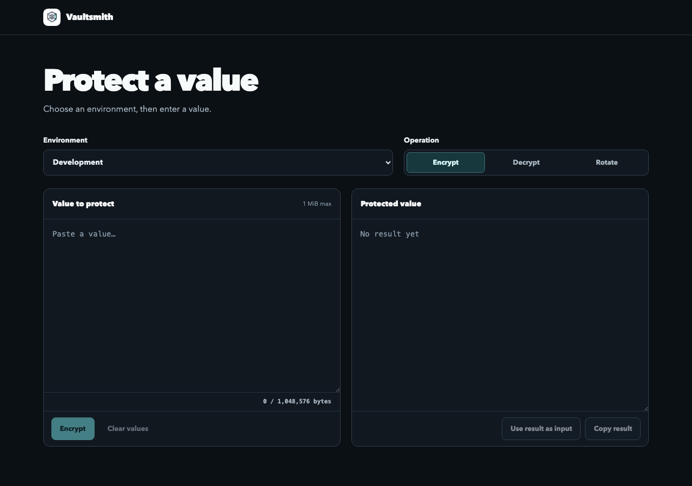
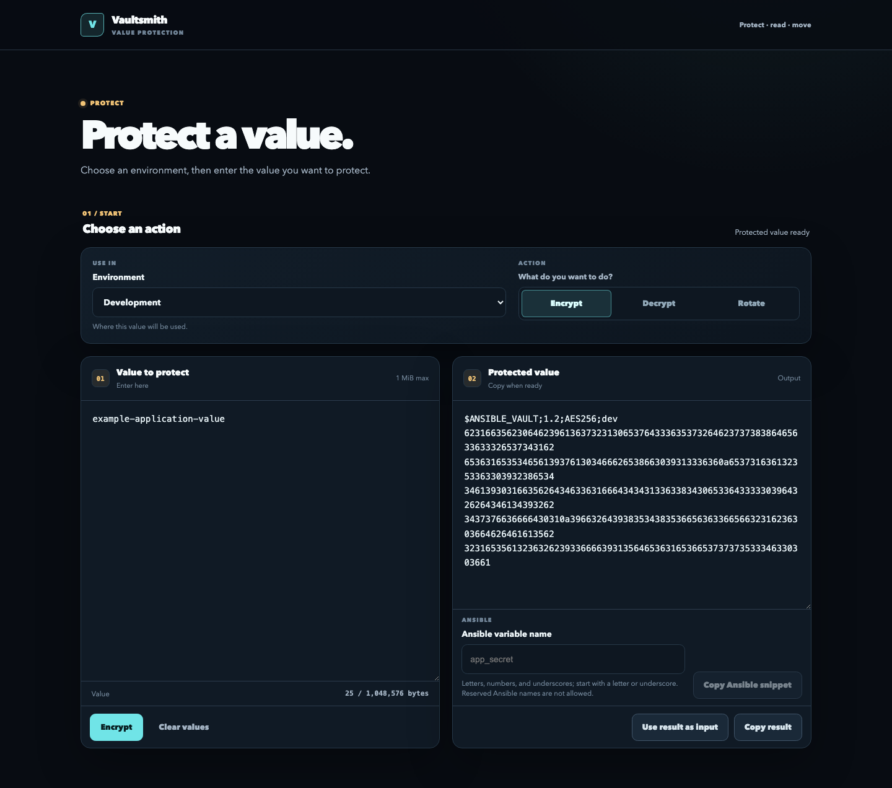

# Vaultsmith

Vaultsmith is a web UI and HTTP API for encrypting, decrypting, and re-keying Ansible Vault values, and for generating private material directly into an Ansible Vault envelope. It supports Ansible Vault 1.1 and 1.2/AES256. The Go server embeds the React frontend in the built binary.

## What it does

- Encrypt a value with a selected vault profile.
- Decrypt an existing Ansible Vault value.
- Re-key a value from one profile to another.
- Generate passwords, tokens, SSH keypairs, age identities, and X.509 private keys with CSRs, returning the sealed Vault text and permitted public companion without private plaintext.
- Copy an Ansible `!vault` variable snippet from the result.

The server reads vault passwords from environment variables. It does not persist submitted values or accept file uploads. Native mode uses an opaque, HTTP-only session cookie and a separate readable CSRF cookie; passwords and plaintext are not stored in browser state. Request bodies are not logged.

Application limits:

- Encrypt input: 1 MiB of UTF-8 plaintext.
- Decrypt and re-key input: 5 MiB of UTF-8 Vault text.
- Generate REST request body: 64 KiB.
- Generate MCP request body: 8 MiB.
- Standard Encrypt, Decrypt, and Rotate JSON request bodies: 8 MiB.





## Use Vaultsmith

### Install with Helm

The public OCI chart command below uses the release-managed chart version:

```sh
VAULTSMITH_CHART_VERSION=0.7.0 # x-release-please-version
helm upgrade --install vaultsmith \
  oci://ghcr.io/forgeplane-io/charts/vaultsmith \
  --version "$VAULTSMITH_CHART_VERSION" \
  --namespace vaultsmith \
  --create-namespace \
  -f /path/to/vaultsmith-values.yaml
```

Use `auth.mode: native` for a deployed instance. The chart includes the official Valkey chart and generates its password Secret by default, so you do not need to provision Redis or Valkey separately. Native mode still requires OIDC, a CSRF Secret, a Casbin policy, and profile-password Secrets. If NetworkPolicy is enabled, allow DNS and OIDC egress explicitly; the chart adds egress to the bundled Valkey pods. Set `valkey.enabled: false` only when using an external Redis-compatible service, then configure `auth.redis.address` and its credentials.

Proofs are disabled by default. To enable them, create a Secret managed by your secret workflow with the fixed `keyring.json` data key, then set only `proofs.enabled: true` and `proofs.existingSecret`. The chart mounts the keyring read-only at a fixed path; `PUBLIC_BASE_URL` remains the issuer source. See [`docs/attestations.md`](docs/attestations.md) for the key lifecycle and operator runbook.

The chart creates `ClusterIP` Services for Vaultsmith and Valkey. Ingress and NetworkPolicy are disabled by default. Put a maintained TLS and authentication edge in front of Vaultsmith. NetworkPolicy does not authenticate HTTP callers.

For the complete values example, policy format, edge boundary, verification steps, and rollback guidance, see [`docs/deployment.md`](docs/deployment.md).

For a source checkout, use `deploy/helm/vaultsmith` instead of the OCI reference and omit `--version`; the source chart version is maintained separately.

### Authentication

Set `AUTH_MODE` explicitly:

| Mode | Use | Behavior |
| --- | --- | --- |
| `native` | Protected deployments | OIDC Authorization Code + PKCE, Redis-backed opaque sessions, CSRF protection, and profile-scoped Casbin authorization. |
| `off` | Private local development only | Skips authentication and CSRF protection. |

An unset or blank mode is a startup error. Native mode does not fall back to `off` when OIDC, Redis, or policy loading fails. In Helm YAML, write the development value as `mode: "off"`; unquoted `off` may parse as Boolean `false` and is rejected.

Native mode uses the verified `(iss, sub)` pair as identity. Browser users authenticate with OIDC Authorization Code + PKCE and Redis-backed sessions. Machine clients can use RFC 9068 JWT Bearer access tokens whose audience is the `PUBLIC_BASE_URL` HTTPS origin. Client-provided identity headers are ignored. If the issuer uses a private CA, mount a PEM bundle and set `OIDC_CA_FILE`. Do not disable TLS verification.

### HTTP API

The bundled UI uses the canonical REST API. The deprecated legacy operation endpoint remains for v1 compatibility only. Canonical REST and the legacy endpoint share the same service behavior, limits, no-store responses, request IDs, 30-second application deadline, and admission limit. Configured CORS origins are explicit.

- [Static REST API reference](docs/api-reference.md)
- [Rotation attestation operator runbook](docs/attestations.md)
- [Authentication and authorization](docs/authentication.md)
- [Safe REST and MCP client examples](docs/api-clients.md)
- [Deployment and gateway controls](docs/deployment.md)

| Method and path | Purpose |
| --- | --- |
| `GET /healthz` | Liveness. |
| `GET /readyz` | Readiness. |
| `GET /api/v1/session` | Session and CSRF bootstrap. |
| `GET /api/v1/profiles` | Canonical profile discovery. |
| `POST /api/v1/profiles/{profileId}/encrypt` | Canonical Encrypt API. |
| `POST /api/v1/profiles/{profileId}/decrypt` | Canonical Decrypt API. |
| `POST /api/v1/rotations` | Canonical Rotate API (re-key in the UI), with optional attestation issuance. |
| `POST /api/v1/generate` | Generate private material in memory and return only its Vault ciphertext and permitted public companion. |
| `POST /api/v1/attestations/verify` | Verify a rotation attestation against supplied envelopes and binding. |
| `GET /.well-known/vaultsmith-attestation` | Public attestation metadata when proofs are enabled. |
| `GET /.well-known/vaultsmith-attestation/jwks.json` | Public attestation keys when proofs are enabled. |
| `GET /.well-known/oauth-protected-resource` | Native-mode protected-resource metadata. |
| `POST /mcp` | MCP Streamable HTTP endpoint when `MCP_ENABLED=true`. |
| `GET /metrics` | Private bounded operation, attestation, keyring, and admission metrics. |
| `GET /auth/login` | Start native OIDC login. |
| `GET /auth/callback` | Complete native OIDC login. |
| `POST /auth/logout` | CSRF-protected logout. |

### Legacy compatibility

`POST /api/v1/operations` is the deprecated legacy operation endpoint. It remains only for existing v1 compatibility callers. New clients and the bundled UI must use the canonical REST API above. Generate is available only at `POST /api/v1/generate`; it is not a legacy operation mode.

Operation modes are `encrypt`, `decrypt`, and `rotate` (the API name for re-key). A re-key request names `sourceProfileId` and `destinationProfileId`. In native mode, session mutations require the CSRF token returned by `/api/v1/session`; Bearer requests do not use sessions or CSRF and require the exact operation scope. Attestation verification uses `vaultsmith.attestation.verify`; issuance uses the rotate path and does not create a new operation scope. MCP is disabled by default with `mcp.enabled: false` / `MCP_ENABLED=false`. Proofs are disabled by default with `proofs.enabled: false`; normal Vault operations remain available when proofs are disabled.

Keep plaintext, ciphertext, passwords, cookies, and tokens out of shell history, logs, screenshots, tickets, and pull requests.

## Development

### Run locally

Requirements:

- Go 1.25 or newer
- Node.js 22 and npm
- Bash, `curl`, and `tar`
- Python 3.9 or newer
- `sha256sum` or `shasum`

`ansible-vault` is not required at runtime. The `make compatibility` target requires the CLI to be installed.

Build the frontend, then start a loopback-only server in `off` mode:

```sh
npm ci --prefix frontend
npm run build --prefix frontend

export VAULT_PROFILES_JSON='[{"id":"dev","label":"Development","passwordEnv":"VAULT_PASSWORD_DEV"}]'
export VAULT_PASSWORD_DEV='replace-with-a-local-password'
export AUTH_MODE=off
export COOKIE_SECURE=false  # local HTTP only
export HTTP_ADDR=127.0.0.1:8080

go run ./backend/cmd/server
```

Open <http://localhost:8080>. Check the process with:

```sh
curl -fsS http://localhost:8080/healthz
curl -fsS http://localhost:8080/readyz
```

Never expose an off-mode server.

For frontend development, keep the Go server running and start Vite in a second terminal:

```sh
npm run dev --prefix frontend
```

Vite listens on <http://localhost:5173> and proxies `/api`, `/healthz`, and `/readyz` to the Go server.

`VAULT_PROFILES_JSON` defines the profiles shown to the browser. Each profile refers to a separate environment variable containing its password:

```json
[
  {
    "id": "dev",
    "label": "Development",
    "passwordEnv": "VAULT_PASSWORD_DEV"
  },
  {
    "id": "prod",
    "label": "Production",
    "passwordEnv": "VAULT_PASSWORD_PROD"
  }
]
```

The server rejects duplicate profile IDs, reserved environment names, missing passwords, and invalid profile metadata. Password values never appear in the profiles API.

### Native integration test

The disposable harness starts Redis, Keycloak, local TLS edges, and Vaultsmith with generated credentials:

```sh
./scripts/integration-native.sh
```

For browser testing, keep the stack running:

```sh
./scripts/integration-native.sh --interactive
```

The harness removes its containers, volumes, and temporary state on exit unless `KEEP_INTEGRATION_TMP=1` is set. See [`integration/README.md`](integration/README.md) for the test flow and cleanup rules.

### Checks

```sh
npm ci --prefix frontend
npm ci --prefix api/typescript-generator --ignore-scripts
make lint
npm test --prefix frontend -- --run
make typecheck
make api-check
make build
make test
make smoke
make helm-lint
make chart-test
```

Use `SMOKE_PORT=18080 ./scripts/smoke.sh` when port 8080 is busy.

See [`CONTRIBUTING.md`](CONTRIBUTING.md) for pull-request, release, and sensitive-data rules. Report vulnerabilities as described in [`SECURITY.md`](SECURITY.md).

## License

Apache License 2.0. See [`LICENSE`](LICENSE).
